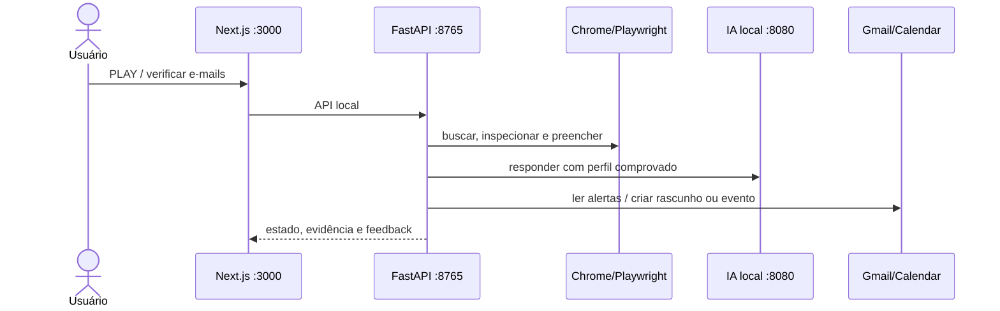

# Arquitetura

## Visão geral

CareerOS é um monorepo local-first com dois caminhos complementares:

- `apps/web` fornece o painel Next.js e encaminha `/agent/*` para o host local.
- `apps/automation-host` coordena Playwright, perfil, vagas, candidaturas, IA local, Gmail e Agenda.
- `apps/api`, `apps/worker`, PostgreSQL, Redis, Prometheus e Grafana formam a fundação para persistência e observabilidade estruturadas.

## Estado local

`.runtime/` concentra perfil profissional, currículo importado, vagas, fila de candidaturas, decisões da IA, conhecimento de layout, token Google e alertas. Essa pasta nunca deve ser versionada.

Arquivos principais:

- `professional-profile.json`: fatos aprovados sobre o candidato.
- `jobs.json`: vagas coletadas e analisadas.
- `applications.json`: estado e evidência de cada candidatura.
- `automation-events.jsonl`: trilha de execução.
- `layout-knowledge.json`: impedimentos e aprendizado de layouts.
- `google/career-mail.json`: classificação local de mensagens.

## Limites de confiança

O host separa descoberta, análise, preparação e submissão. A IA local responde apenas com evidência do perfil; confiança inferior ao limite vira intervenção. CAPTCHA, MFA, teste, pergunta sensível ou confirmação ambígua interrompem o fluxo.

## Integrações

- Chrome persistente: perfil dedicado em `.runtime/browser-profiles/default`.
- IA: API compatível com OpenAI em `LOCAL_AI_URL`, normalmente llama.cpp em `127.0.0.1:8080/v1`.
- Google: OAuth Desktop com credenciais e token em `.runtime/google/`.
- Plataformas: adaptadores e seletores isolados no automation host.

## Decisões

Consulte [ADR 0001](docs/decisions/0001-modular-monorepo.md) e [IA e Google](docs/AI_AND_GOOGLE.md).
