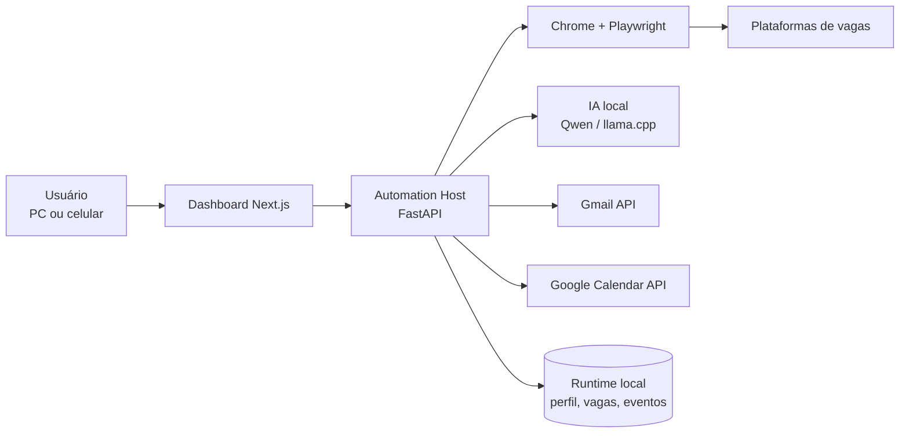

<div align="center">

# CareerOS

### Central local e inteligente para busca, candidatura e acompanhamento de carreira

[](apps/web)
[](apps/automation-host)
[](apps/automation-host)
[](docs/AI_AND_GOOGLE.md)
[](docs/AI_AND_GOOGLE.md)
[](SETUP_WINDOWS.md)

**Busca vagas · calcula aderência · prepara candidaturas · acompanha respostas · organiza entrevistas**

</div>

> [!IMPORTANT]
> O CareerOS é uma aplicação pessoal executada no computador do usuário. Logins, CAPTCHA, MFA, tokens, currículos, perfil do navegador e histórico ficam fora do Git. Revise cada integração e os termos das plataformas antes de utilizar automação.

## O que já funciona

| Área | Capacidade |
|---|---|
| Painel | Interface responsiva em `localhost:3000`, acessível também pelo celular na mesma rede |
| Perfil | Currículo PDF, dados profissionais, competências, cargos e preferências salariais |
| Vagas | Coleta assistida em InfoJobs, Indeed, Catho e LinkedIn |
| Decisão | Score explicável, prioridade geográfica e regras flexíveis de remuneração |
| Candidaturas | Preparação, preenchimento, confirmação real, histórico, tentativas e feedback por vaga |
| Navegador | Chrome persistente com Playwright; login manual, CAPTCHA e MFA permanecem visíveis |
| IA local | Respostas fundamentadas somente no currículo/perfil, com limite de confiança e intervenção humana |
| Gmail | Monitoramento periódico, deduplicação e classificação de entrevistas, questionários e confirmações |
| Questionários | Extração e validação de links, bloqueio de rastreadores e identificação de concluído/pendente/indisponível |
| Agenda | Criação explícita de compromissos quando data e horário são comprovados, com prevenção de duplicidade |
| Segurança | Parada de emergência, Gupy bloqueada, segredos ignorados e trilha JSON local |

## Visão do sistema



O painel é a única porta de operação. O host local coordena navegador, IA e Google; os dados sensíveis permanecem em `.runtime/`, ignorado pelo Git.

## Início rápido no Windows

Requisitos: Windows 11, Chrome, Python 3.12+, Node.js 22+ e Docker Desktop para os serviços opcionais.

```powershell
git clone https://github.com/MrSantana1990/CareerOS.git
Set-Location CareerOS
Copy-Item .env.example .env
# Altere obrigatoriamente as senhas do .env
./scripts/setup.ps1
./scripts/start.ps1
```

Acesse:

- Painel local: `http://localhost:3000`
- Celular no mesmo Wi‑Fi: `http://IP-DO-COMPUTADOR:3000`
- Automation Host: `http://localhost:8765/docs`
- API de fundação: `http://localhost:8001/docs`

Consulte [SETUP_WINDOWS.md](SETUP_WINDOWS.md) para Google OAuth, IA local e solução de problemas.

## Operação diária

1. Mantenha o computador ligado e os serviços ativos.
2. Entre nas plataformas pelo Chrome persistente do CareerOS.
3. Revise perfil, currículo, cargos e regiões.
4. Use **PLAY — Fazer tudo agora** ou aguarde os horários configurados.
5. Confira **Candidaturas** para distinguir enviada, encerrada, manual ou falha.
6. Confira **E-mails e Agenda** para entrevistas, questionários e confirmações.

O agendador local verifica candidaturas às `08:00`, `12:00` e `18:00`. O Gmail é monitorado a cada 10 minutos enquanto o host estiver ativo.

## Princípios de segurança

- A IA nunca deve inventar experiência, formação, idioma, salário ou disponibilidade.
- CAPTCHA, MFA, testes técnicos e campos sem evidência exigem intervenção.
- Uma candidatura só conta como enviada quando a plataforma apresenta confirmação.
- Rascunho no Gmail não significa mensagem enviada.
- Evento na Agenda só é criado por ação explícita e com data/horário exatos.
- Gupy permanece bloqueada por decisão do projeto.

Leia [SECURITY.md](SECURITY.md), [DATA_PRIVACY.md](DATA_PRIVACY.md), [AUTOMATION_RULES.md](AUTOMATION_RULES.md) e [THREAT_MODEL.md](THREAT_MODEL.md).

## Estrutura

```text
apps/
  web/                 painel Next.js
  automation-host/     Playwright, IA, Gmail e Agenda
  api/                 fundação de API, banco e métricas
  worker/              tarefas assíncronas
scripts/               instalação, início, parada e OAuth
infrastructure/        observabilidade
docs/                  decisões e integrações
.runtime/              dados privados locais (não versionados)
```

## Documentação

- [Arquitetura](ARCHITECTURE.md)
- [API e endpoints](API.md)
- [IA local e Google](docs/AI_AND_GOOGLE.md)
- [Instalação Windows](SETUP_WINDOWS.md)
- [Regras de automação](AUTOMATION_RULES.md)
- [Segurança](SECURITY.md)
- [Privacidade](DATA_PRIVACY.md)
- [Desenvolvimento](DEVELOPMENT.md)
- [Roadmap](ROADMAP.md)
- [Solução de problemas](TROUBLESHOOTING.md)

## Estado do projeto

O CareerOS está em evolução ativa. Seletores de sites externos podem mudar sem aviso; por isso o projeto registra impedimentos, preserva evidências e prefere interromper uma ação incerta a registrar um falso sucesso.

---

<div align="center">Construído para uma operação de carreira local, transparente e controlável.</div>
